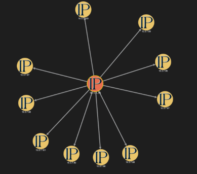

# Cytoscape To JSON

**Program Design Purpose**: We want to convert some cystoscape nodes-edges graph file (under *.pkl format) to JSON format files which can be used by other program.

[TOC]


#### Introduction

This module will provide functions to convert the cytoscape graph pickle files to JSON format file and find the geo-location of the public IP address. The geo-location information will be append in the nodes' related data. The program can process 2 kinds of cytoscape file:

**'case*'** : Each case file should only have one cytoscape build in.

**'linked_*', 'subgraphs_*'** : The linked or subgraphs files can have multiple cytoscape graphs build in. The graph need to have a graph name as "key".

A simple cytoscape graph: 



Version: v_0.1


------

#### Program Setup

###### Development Environment : python 3.7.10

###### Additional Lib/Software Need

1. **networkx** : https://pypi.org/project/networkx/

   ```
   pip install networkx
   ```
   
2. **geolite2**: https://pypi.org/project/python-geoip-geolite2/

   ```
   pip install python-geoip-python3
   ```

4. 

###### Hardware Needed : None

###### Program Files List 

version: v0.2

| Program File            | Execution Env | Description                        |
| ----------------------- | ------------- | ---------------------------------- |
| src/Cytoscape_2_Json.py | python 3      | Main executable program.           |
| src/data                |               | folder to store all the data file. |


------

#### Program Usage

###### Program Execution 

1. Copy all the cytoscape `*pkl` files in the folder `src/data`

2. Cd to the program folder and run program execution cmd: 

   ```
   python Cytoscape_2_Json.py
   ```

3. Check the result: 

   All the converted JSON file will be saved in the folder `src/<type>/result` the result file will be same as the data source file as shown below: 
   
   Example:
   
    `src/data/case_1` => `src/result/case/case_1.json`
   
   `src/data/linked_graphs_sep_2019` => `src/result/linked/linked_graphs_sep_2019.json`
   
   `src/data/subgraphs_sep_2019` => `src/result/subgraphs/subgraphs_sep_2019.json`

###### Module API Usage

- Convert Case File: `caseCvt(filePath, outPutDir)`
- Convert Multi-graphs file: `graphCvt(filePath, outPutDir, graphType='linked',graphName='snort_forti')`

------

#### Problem and Solution

###### Problem: python-geoip does not support Python 3

**OS Platform** : Windows/Linux

**Error Message**: module not found

**Type**: Setup exception

**Solution**:

Install the python3 compatible version with cmd `pip install python-geoip-python3` 

**Related Reference**:  https://stackoverflow.com/questions/32575666/python-geoip-does-not-work-on-python3-4


------

#### Reference 

- https://cytoscape.org/
- https://stackoverflow.com/questions/32575666/python-geoip-does-not-work-on-python3-4


------

> Last edit by LiuYuancheng(liu_yuan_cheng@hotmail.com) at 21/12/2021

